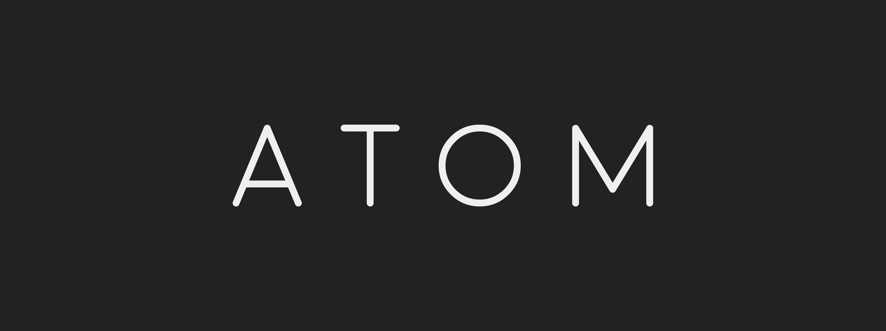

    <picture>
        <source media="(prefers-color-scheme: dark)" srcset="./IMAGES/ATOM-logo-banner-light.png" | width=600>
        <source media="(prefers-color-scheme: light)" srcset="./IMAGES/ATOM-logo-banner-dark.png" | width=600>
        
    </picture>

## ATOM-Toolhead

ATOM is a part of a the ICS printer design. Although it can be used on most printers with front mounted gantry rail.

ATOM is a lightweight all metal (or partially printed) toolhead that utilises CPAP for part cooling. The extruder mounted to this toolhead is called PROTON, it is a minimal fixed idler BMG repackage. It works with Bondtech OEM RIDGA V2 or a classic BMG kit with reversed feeder gears. It can be FDM/SLM printed as well as CNC’d, with the metal variants it can also easily be watercooled.

The partially printed ATOM variant uses laser cut/CNC’d plates in combination with printed parts, and the full metal variant uses all CNC’d parts.

It uses 9mm belts (4mm edge to edge spacing) and a front mounted MGN9H rail. However due to the modularity of the toolhead, with minor adjustments it can be used with 6mm belts and all MGN12 or 9 blocks as well.

It is designed with a laser cut 3mm alu adapter plate between the hotend and extruder. So it is very simple to adapt it to different hotends. This also gives the opportunity to directly watercool the hotend in combination with the WC PROTON block.

The weight for the all metal version without linear block, hotend and CAN toolboard is around 200g. It will be slightly less with some of the parts printed instead.

Renders and more pictures are coming SOON™ 🙂

*This is still a WIP, so any feedback is highly welcome!
